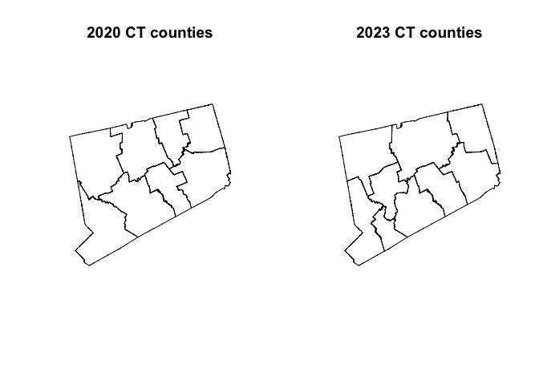

<!-- README.md is generated from README.Rmd. Please edit that file -->

# geolinkr

geolinkr is an R package that creates crosswalks for empirical
comparisons across geographies and over time using shapefiles.

You can create a crosswalk by providing three shapefiles to the
`create_cw()` function:

- `from_sf`: A shapefile with the **source** geographies as an [sf
  object](https://github.com/r-spatial/sf?tab=readme-ov-file#simple-features-for-r)
- `to_sf`: A shapefile with the **target** geographies as an sf object.
- `wts_sf`: A shapefile usually with census blocks or tracts
  delineations and a weighting variable, such as population or household
  counts, to allocate geographies from `from_sf` to `to_sf`.

See [Examples](#Examples)

## Installation

``` r
# install.packages("remotes")
remotes::install_github("ChandlerLutz/geolinkr")
```

## Examples

In 2023, Connecticut updated its county definitions, creating a break in
various economic datasets. We can use the `geolinkr::create_cw()`
function to create a crosswalk from the Connecticut 2020 to the 2023
county definitions, using household counts at the tract level as weights

- Note: It’s typically best to use the smallest available delineations,
  such as Census blocks, for the weights, but we’ll use tracts to keep
  the example tractable.

First, download the 2020 CT county delineations (the source) and the
2023 CT county delineations (the target):

``` r
library(geolinkr)
library(sf)
library(tigris)

# 2020 CT counties -- source shapefile 
ct_cnty20 <- tigris::counties(state = "CT", year = 2020) |>
  st_transform(crs = 5070) |>
  _[, c("GEOID", "geometry")]
#>   |                                                                              |                                                                      |   0%  |                                                                              |                                                                      |   1%  |                                                                              |=                                                                     |   1%  |                                                                              |=                                                                     |   2%  |                                                                              |==                                                                    |   2%  |                                                                              |==                                                                    |   3%  |                                                                              |==                                                                    |   4%  |                                                                              |===                                                                   |   4%  |                                                                              |===                                                                   |   5%  |                                                                              |====                                                                  |   5%  |                                                                              |====                                                                  |   6%  |                                                                              |=====                                                                 |   6%  |                                                                              |=====                                                                 |   7%  |                                                                              |=====                                                                 |   8%  |                                                                              |======                                                                |   8%  |                                                                              |======                                                                |   9%  |                                                                              |=======                                                               |   9%  |                                                                              |=======                                                               |  10%  |                                                                              |=======                                                               |  11%  |                                                                              |========                                                              |  11%  |                                                                              |========                                                              |  12%  |                                                                              |=========                                                             |  12%  |                                                                              |=========                                                             |  13%  |                                                                              |=========                                                             |  14%  |                                                                              |==========                                                            |  14%  |                                                                              |==========                                                            |  15%  |                                                                              |===========                                                           |  15%  |                                                                              |===========                                                           |  16%  |                                                                              |============                                                          |  16%  |                                                                              |============                                                          |  17%  |                                                                              |============                                                          |  18%  |                                                                              |=============                                                         |  18%  |                                                                              |=============                                                         |  19%  |                                                                              |==============                                                        |  19%  |                                                                              |==============                                                        |  20%  |                                                                              |==============                                                        |  21%  |                                                                              |===============                                                       |  21%  |                                                                              |===============                                                       |  22%  |                                                                              |================                                                      |  22%  |                                                                              |================                                                      |  23%  |                                                                              |================                                                      |  24%  |                                                                              |=================                                                     |  24%  |                                                                              |=================                                                     |  25%  |                                                                              |==================                                                    |  25%  |                                                                              |==================                                                    |  26%  |                                                                              |===================                                                   |  26%  |                                                                              |===================                                                   |  27%  |                                                                              |===================                                                   |  28%  |                                                                              |====================                                                  |  28%  |                                                                              |====================                                                  |  29%  |                                                                              |=====================                                                 |  29%  |                                                                              |=====================                                                 |  30%  |                                                                              |=====================                                                 |  31%  |                                                                              |======================                                                |  31%  |                                                                              |======================                                                |  32%  |                                                                              |=======================                                               |  32%  |                                                                              |=======================                                               |  33%  |                                                                              |=======================                                               |  34%  |                                                                              |========================                                              |  34%  |                                                                              |========================                                              |  35%  |                                                                              |=========================                                             |  35%  |                                                                              |=========================                                             |  36%  |                                                                              |==========================                                            |  36%  |                                                                              |==========================                                            |  37%  |                                                                              |==========================                                            |  38%  |                                                                              |===========================                                           |  38%  |                                                                              |===========================                                           |  39%  |                                                                              |============================                                          |  39%  |                                                                              |============================                                          |  40%  |                                                                              |============================                                          |  41%  |                                                                              |=============================                                         |  41%  |                                                                              |=============================                                         |  42%  |                                                                              |==============================                                        |  42%  |                                                                              |==============================                                        |  43%  |                                                                              |==============================                                        |  44%  |                                                                              |===============================                                       |  44%  |                                                                              |===============================                                       |  45%  |                                                                              |================================                                      |  45%  |                                                                              |================================                                      |  46%  |                                                                              |=================================                                     |  46%  |                                                                              |=================================                                     |  47%  |                                                                              |=================================                                     |  48%  |                                                                              |==================================                                    |  48%  |                                                                              |==================================                                    |  49%  |                                                                              |===================================                                   |  49%  |                                                                              |===================================                                   |  50%  |                                                                              |===================================                                   |  51%  |                                                                              |====================================                                  |  51%  |                                                                              |====================================                                  |  52%  |                                                                              |=====================================                                 |  52%  |                                                                              |=====================================                                 |  53%  |                                                                              |=====================================                                 |  54%  |                                                                              |======================================                                |  54%  |                                                                              |======================================                                |  55%  |                                                                              |=======================================                               |  55%  |                                                                              |=======================================                               |  56%  |                                                                              |========================================                              |  56%  |                                                                              |========================================                              |  57%  |                                                                              |========================================                              |  58%  |                                                                              |=========================================                             |  58%  |                                                                              |=========================================                             |  59%  |                                                                              |==========================================                            |  59%  |                                                                              |==========================================                            |  60%  |                                                                              |==========================================                            |  61%  |                                                                              |===========================================                           |  61%  |                                                                              |===========================================                           |  62%  |                                                                              |============================================                          |  62%  |                                                                              |============================================                          |  63%  |                                                                              |============================================                          |  64%  |                                                                              |=============================================                         |  64%  |                                                                              |=============================================                         |  65%  |                                                                              |==============================================                        |  65%  |                                                                              |==============================================                        |  66%  |                                                                              |===============================================                       |  66%  |                                                                              |===============================================                       |  67%  |                                                                              |===============================================                       |  68%  |                                                                              |================================================                      |  68%  |                                                                              |================================================                      |  69%  |                                                                              |=================================================                     |  69%  |                                                                              |=================================================                     |  70%  |                                                                              |=================================================                     |  71%  |                                                                              |==================================================                    |  71%  |                                                                              |==================================================                    |  72%  |                                                                              |===================================================                   |  72%  |                                                                              |===================================================                   |  73%  |                                                                              |===================================================                   |  74%  |                                                                              |====================================================                  |  74%  |                                                                              |====================================================                  |  75%  |                                                                              |=====================================================                 |  75%  |                                                                              |=====================================================                 |  76%  |                                                                              |======================================================                |  76%  |                                                                              |======================================================                |  77%  |                                                                              |======================================================                |  78%  |                                                                              |=======================================================               |  78%  |                                                                              |=======================================================               |  79%  |                                                                              |========================================================              |  79%  |                                                                              |========================================================              |  80%  |                                                                              |========================================================              |  81%  |                                                                              |=========================================================             |  81%  |                                                                              |=========================================================             |  82%  |                                                                              |==========================================================            |  82%  |                                                                              |==========================================================            |  83%  |                                                                              |==========================================================            |  84%  |                                                                              |===========================================================           |  84%  |                                                                              |===========================================================           |  85%  |                                                                              |============================================================          |  85%  |                                                                              |============================================================          |  86%  |                                                                              |=============================================================         |  86%  |                                                                              |=============================================================         |  87%  |                                                                              |=============================================================         |  88%  |                                                                              |==============================================================        |  88%  |                                                                              |==============================================================        |  89%  |                                                                              |===============================================================       |  89%  |                                                                              |===============================================================       |  90%  |                                                                              |===============================================================       |  91%  |                                                                              |================================================================      |  91%  |                                                                              |================================================================      |  92%  |                                                                              |=================================================================     |  92%  |                                                                              |=================================================================     |  93%  |                                                                              |=================================================================     |  94%  |                                                                              |==================================================================    |  94%  |                                                                              |==================================================================    |  95%  |                                                                              |===================================================================   |  95%  |                                                                              |===================================================================   |  96%  |                                                                              |====================================================================  |  96%  |                                                                              |====================================================================  |  97%  |                                                                              |====================================================================  |  98%  |                                                                              |===================================================================== |  98%  |                                                                              |===================================================================== |  99%  |                                                                              |======================================================================|  99%  |                                                                              |======================================================================| 100%
names(ct_cnty20) <- c("geoid", "geometry")

# 2023 CT counties -- target shapefile
ct_cnty23 <- tigris::counties(state = "CT", year = 2023) |>
  st_transform(crs = 5070) |>
  _[, c("GEOID", "geometry")]
#>   |                                                                              |                                                                      |   0%  |                                                                              |                                                                      |   1%  |                                                                              |=                                                                     |   1%  |                                                                              |=                                                                     |   2%  |                                                                              |==                                                                    |   2%  |                                                                              |==                                                                    |   3%  |                                                                              |==                                                                    |   4%  |                                                                              |===                                                                   |   4%  |                                                                              |===                                                                   |   5%  |                                                                              |====                                                                  |   5%  |                                                                              |====                                                                  |   6%  |                                                                              |=====                                                                 |   6%  |                                                                              |=====                                                                 |   7%  |                                                                              |=====                                                                 |   8%  |                                                                              |======                                                                |   8%  |                                                                              |======                                                                |   9%  |                                                                              |=======                                                               |   9%  |                                                                              |=======                                                               |  10%  |                                                                              |=======                                                               |  11%  |                                                                              |========                                                              |  11%  |                                                                              |========                                                              |  12%  |                                                                              |=========                                                             |  12%  |                                                                              |=========                                                             |  13%  |                                                                              |=========                                                             |  14%  |                                                                              |==========                                                            |  14%  |                                                                              |==========                                                            |  15%  |                                                                              |===========                                                           |  15%  |                                                                              |===========                                                           |  16%  |                                                                              |============                                                          |  16%  |                                                                              |============                                                          |  17%  |                                                                              |============                                                          |  18%  |                                                                              |=============                                                         |  18%  |                                                                              |=============                                                         |  19%  |                                                                              |==============                                                        |  19%  |                                                                              |==============                                                        |  20%  |                                                                              |==============                                                        |  21%  |                                                                              |===============                                                       |  21%  |                                                                              |===============                                                       |  22%  |                                                                              |================                                                      |  22%  |                                                                              |================                                                      |  23%  |                                                                              |================                                                      |  24%  |                                                                              |=================                                                     |  24%  |                                                                              |=================                                                     |  25%  |                                                                              |==================                                                    |  25%  |                                                                              |==================                                                    |  26%  |                                                                              |===================                                                   |  26%  |                                                                              |===================                                                   |  27%  |                                                                              |===================                                                   |  28%  |                                                                              |====================                                                  |  28%  |                                                                              |====================                                                  |  29%  |                                                                              |=====================                                                 |  29%  |                                                                              |=====================                                                 |  30%  |                                                                              |=====================                                                 |  31%  |                                                                              |======================                                                |  31%  |                                                                              |======================                                                |  32%  |                                                                              |=======================                                               |  32%  |                                                                              |=======================                                               |  33%  |                                                                              |=======================                                               |  34%  |                                                                              |========================                                              |  34%  |                                                                              |========================                                              |  35%  |                                                                              |=========================                                             |  35%  |                                                                              |=========================                                             |  36%  |                                                                              |==========================                                            |  36%  |                                                                              |==========================                                            |  37%  |                                                                              |==========================                                            |  38%  |                                                                              |===========================                                           |  38%  |                                                                              |===========================                                           |  39%  |                                                                              |============================                                          |  39%  |                                                                              |============================                                          |  40%  |                                                                              |============================                                          |  41%  |                                                                              |=============================                                         |  41%  |                                                                              |=============================                                         |  42%  |                                                                              |==============================                                        |  42%  |                                                                              |==============================                                        |  43%  |                                                                              |==============================                                        |  44%  |                                                                              |===============================                                       |  44%  |                                                                              |===============================                                       |  45%  |                                                                              |================================                                      |  45%  |                                                                              |================================                                      |  46%  |                                                                              |=================================                                     |  46%  |                                                                              |=================================                                     |  47%  |                                                                              |=================================                                     |  48%  |                                                                              |==================================                                    |  48%  |                                                                              |==================================                                    |  49%  |                                                                              |===================================                                   |  49%  |                                                                              |===================================                                   |  50%  |                                                                              |===================================                                   |  51%  |                                                                              |====================================                                  |  51%  |                                                                              |====================================                                  |  52%  |                                                                              |=====================================                                 |  52%  |                                                                              |=====================================                                 |  53%  |                                                                              |=====================================                                 |  54%  |                                                                              |======================================                                |  54%  |                                                                              |======================================                                |  55%  |                                                                              |=======================================                               |  55%  |                                                                              |=======================================                               |  56%  |                                                                              |========================================                              |  56%  |                                                                              |========================================                              |  57%  |                                                                              |========================================                              |  58%  |                                                                              |=========================================                             |  58%  |                                                                              |=========================================                             |  59%  |                                                                              |==========================================                            |  59%  |                                                                              |==========================================                            |  60%  |                                                                              |==========================================                            |  61%  |                                                                              |===========================================                           |  61%  |                                                                              |===========================================                           |  62%  |                                                                              |============================================                          |  62%  |                                                                              |============================================                          |  63%  |                                                                              |============================================                          |  64%  |                                                                              |=============================================                         |  64%  |                                                                              |=============================================                         |  65%  |                                                                              |==============================================                        |  65%  |                                                                              |==============================================                        |  66%  |                                                                              |===============================================                       |  66%  |                                                                              |===============================================                       |  67%  |                                                                              |===============================================                       |  68%  |                                                                              |================================================                      |  68%  |                                                                              |================================================                      |  69%  |                                                                              |=================================================                     |  69%  |                                                                              |=================================================                     |  70%  |                                                                              |=================================================                     |  71%  |                                                                              |==================================================                    |  71%  |                                                                              |==================================================                    |  72%  |                                                                              |===================================================                   |  72%  |                                                                              |===================================================                   |  73%  |                                                                              |===================================================                   |  74%  |                                                                              |====================================================                  |  74%  |                                                                              |====================================================                  |  75%  |                                                                              |=====================================================                 |  75%  |                                                                              |=====================================================                 |  76%  |                                                                              |======================================================                |  76%  |                                                                              |======================================================                |  77%  |                                                                              |======================================================                |  78%  |                                                                              |=======================================================               |  78%  |                                                                              |=======================================================               |  79%  |                                                                              |========================================================              |  79%  |                                                                              |========================================================              |  80%  |                                                                              |========================================================              |  81%  |                                                                              |=========================================================             |  81%  |                                                                              |=========================================================             |  82%  |                                                                              |==========================================================            |  82%  |                                                                              |==========================================================            |  83%  |                                                                              |==========================================================            |  84%  |                                                                              |===========================================================           |  84%  |                                                                              |===========================================================           |  85%  |                                                                              |============================================================          |  85%  |                                                                              |============================================================          |  86%  |                                                                              |=============================================================         |  86%  |                                                                              |=============================================================         |  87%  |                                                                              |=============================================================         |  88%  |                                                                              |==============================================================        |  88%  |                                                                              |==============================================================        |  89%  |                                                                              |===============================================================       |  89%  |                                                                              |===============================================================       |  90%  |                                                                              |===============================================================       |  91%  |                                                                              |================================================================      |  91%  |                                                                              |================================================================      |  92%  |                                                                              |=================================================================     |  92%  |                                                                              |=================================================================     |  93%  |                                                                              |=================================================================     |  94%  |                                                                              |==================================================================    |  94%  |                                                                              |==================================================================    |  95%  |                                                                              |===================================================================   |  95%  |                                                                              |===================================================================   |  96%  |                                                                              |====================================================================  |  96%  |                                                                              |====================================================================  |  97%  |                                                                              |====================================================================  |  98%  |                                                                              |===================================================================== |  98%  |                                                                              |===================================================================== |  99%  |                                                                              |======================================================================|  99%  |                                                                              |======================================================================| 100%
names(ct_cnty23) <- c("geoid", "geometry")
```

From 2020 to 2023, Connecticut’s county count increased from 8 to 9 and
the definitions changed:

``` r
par(mfrow = c(1, 2))
plot(ct_cnty20$geometry, main = "2020 CT counties")
plot(ct_cnty23$geometry, main = "2023 CT counties")
```



We’ll use the number of housing units in each census tract as weights. I
have prepared other tract, block group, and block shapefiles dating back
to 2000 that you can use for weights
[here](https://github.com/ChandlerLutz/census-blocks-tracks-shp).

``` r
# 2020 CT census tracts -- wts shapefile (with hh2020 as the weight variable)
ct_tracts20 <- readRDS(url("https://github.com/ChandlerLutz/ct-shps/blob/main/ct_tracts20_sf.rds?raw=1")) |>
  st_transform(crs = 5070) |>
  _[, c("GEOID", "hh2020", "geometry")]
names(ct_tracts20) <- c("geoid", "hh2020", "geometry")

print(ct_tracts20)
#> Simple feature collection with 883 features and 2 fields
#> Geometry type: MULTIPOLYGON
#> Dimension:     XY
#> Bounding box:  xmin: 1833460 ymin: 2212666 xmax: 1986019 ymax: 2365559
#> Projected CRS: NAD83 / Conus Albers
#> First 10 features:
#>          geoid hh2020                       geometry
#> 1  09009350400   1195 MULTIPOLYGON (((1882883 228...
#> 2  09009350500   1082 MULTIPOLYGON (((1882319 228...
#> 3  09009352701   1653 MULTIPOLYGON (((1885297 228...
#> 4  09009352702   2509 MULTIPOLYGON (((1885134 228...
#> 5  09009352800   2775 MULTIPOLYGON (((1884388 228...
#> 6  09009166002   2072 MULTIPOLYGON (((1894791 228...
#> 7  09009194202   2015 MULTIPOLYGON (((1917005 228...
#> 8  09009346102   2193 MULTIPOLYGON (((1872516 227...
#> 9  09009351100   1941 MULTIPOLYGON (((1882990 229...
#> 10 09009361300   1624 MULTIPOLYGON (((1882822 229...
```

Finally, we’ll create the crosswalk using the `create_cw()` function.
The output is the crosswalk from 2020 CT counties to 2023 CT counties.

``` r
cw_ct_cnty20_cnty23 <- create_cw(
  from_sf = ct_cnty20,
  to_sf = ct_cnty23,
  wts_sf = ct_tracts20,
  wt_var_name = "hh2020",
  check_that_wts_cover_from_and_to = FALSE
)

print(cw_ct_cnty20_cnty23)
#> Key: <from_geoid, to_geoid>
#>     from_geoid to_geoid       hh2020        afact
#>         <char>   <char>        <num>        <num>
#>  1:      09001    09120 1.253320e+05 3.311465e-01
#>  2:      09001    09140 1.717400e+04 4.537636e-02
#>  3:      09001    09190 2.359730e+05 6.234771e-01
#>  4:      09003    09110 3.535830e+05 9.176656e-01
#>  5:      09003    09140 2.725303e+04 7.073069e-02
#>  6:      09003    09160 4.471000e+03 1.160373e-02
#>  7:      09005    09140 2.381700e+04 2.718370e-01
#>  8:      09005    09160 5.100700e+04 5.821720e-01
#>  9:      09005    09190 1.279100e+04 1.459910e-01
#> 10:      09007    09130 7.628900e+04 1.000000e+00
#> 11:      09009    09110 4.286471e-01 1.161085e-06
#> 12:      09009    09140 1.231375e+05 3.335451e-01
#> 13:      09009    09170 2.460401e+05 6.664538e-01
#> 14:      09011    09130 6.208000e+03 5.052782e-02
#> 15:      09011    09150 1.135000e+03 9.237932e-03
#> 16:      09011    09180 1.155200e+05 9.402342e-01
#> 17:      09013    09110 6.049900e+04 9.938071e-01
#> 18:      09013    09150 3.770000e+02 6.192917e-03
#> 19:      09015    09150 3.992700e+04 8.051422e-01
#> 20:      09015    09180 9.663000e+03 1.948578e-01
#>     from_geoid to_geoid       hh2020        afact
```
